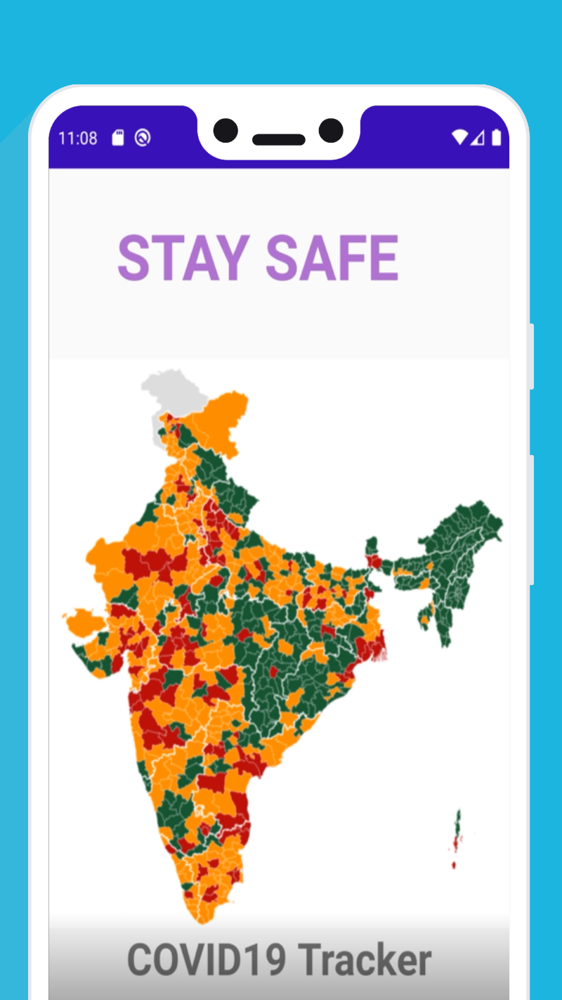

# Covid-19 India Tracker

## Coronavirus Tracker for Android which shows data of confirmed cases, recovered cases and death cases in India.You can also get state-wise data.This application first connect to API to get Data. It saves the data to Local DB and fetched it and shows to UI everytime App is opened.

<table style= padding:10px">
  <tr>
    <td>  </td>
      
 <td></td>
   <td></td>

  </tr>
</table>
